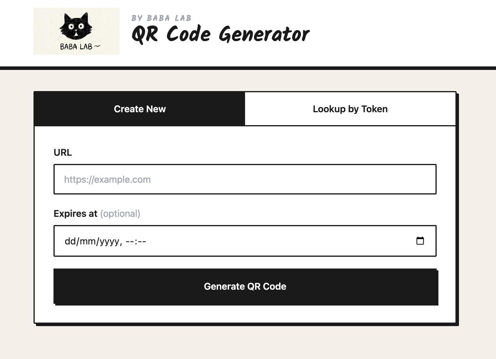
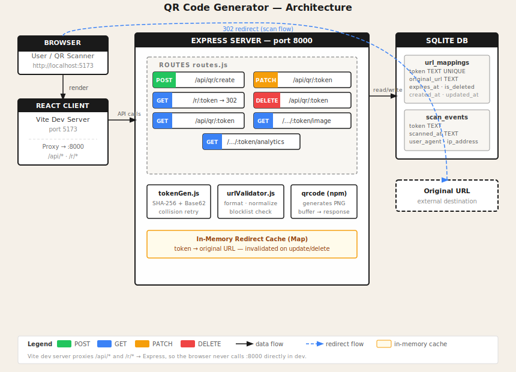

# QR Code Generator

A dynamic QR code system built with Node.js + Express (backend) and React + Vite (frontend). Users submit a long URL and receive a short URL token and a scannable QR code. The QR code encodes the short URL, which redirects to the original — making the target updatable after creation.

---

## App



---

## Architecture



The Vite dev server proxies `/api/*` and `/r/*` to Express on port 8000, so the browser never calls the backend directly in development.

---

## Tech Stack

| Layer | Technology |
|---|---|
| Frontend | React 18, Vite, Tailwind CSS |
| Backend | Node.js, Express 4 |
| Database | SQLite via `better-sqlite3` |
| QR generation | `qrcode` (npm) |

---

## Project Structure

```
qr_code_generator/
├── client/                 # React + Vite frontend
│   ├── src/
│   │   ├── App.jsx         # All UI components
│   │   └── index.css       # Tailwind + sketch design system
│   └── vite.config.js      # Proxy config
├── server/                 # Express backend
│   └── src/
│       ├── index.js        # Server entry point
│       ├── routes.js       # All API + redirect handlers
│       ├── database.js     # SQLite setup & schema
│       ├── tokenGen.js     # SHA-256 + Base62 token generation
│       └── urlValidator.js # URL normalization & blocklist
└── docs/
    └── infrastructure.svg
```

---

## Setup

**Prerequisites:** Node.js 18+

```bash
# Install server dependencies
cd server && npm install

# Install client dependencies
cd ../client && npm install
```

---

## Running

Open two terminals:

```bash
# Terminal 1 — backend (port 8000)
cd server && npm run dev

# Terminal 2 — frontend (port 5173)
cd client && npm run dev
```

Then open **http://localhost:5173**.

---

## API Reference

All endpoints are served by Express on port 8000.

### Create a QR code
```
POST /api/qr/create
Body: { "url": "https://example.com", "expires_at": "<ISO8601 optional>" }
→ 200 { token, short_url, qr_code_url, original_url }
```

### Redirect (scan flow)
```
GET /r/:token
→ 302 to original URL
→ 410 if deleted or expired
→ 404 if token not found
```

### Get info
```
GET /api/qr/:token
→ 200 { token, original_url, created_at, updated_at, expires_at, is_deleted }
```

### Update target URL or expiry
```
PATCH /api/qr/:token
Body: { "url": "https://new-url.com", "expires_at": "<ISO8601 optional>" }
→ 200 updated record
```

### Delete (soft delete)
```
DELETE /api/qr/:token
→ 200 { detail: "Deleted" }
```

### QR code image
```
GET /api/qr/:token/image
→ 200 image/png
```

### Analytics
```
GET /api/qr/:token/analytics
→ 200 { token, total_scans, scans_by_day: [{ date, count }] }
```

---

## Design Decisions

**Why dynamic QR codes?**
The QR code encodes a short URL that your server controls. This means you can update the destination, add expiry, and track scans — none of which is possible with a static QR code that encodes the original URL directly.

**Why 302 (temporary) not 301 (permanent)?**
301 responses are cached by browsers indefinitely, which would break URL updates and prevent scan analytics from being recorded. 302 ensures every scan hits the server.

**Token generation**
SHA-256 hash of `URL + timestamp nonce`, Base62-encoded, 7 characters long. On collision, the nonce increments and retries up to 10 times.

**URL normalization**
URLs are lowercased, trailing slashes stripped, and `http://` upgraded to `https://` before storage — so `http://Example.com/` and `https://example.com` map to the same token.

**Deleted vs non-existent tokens**
Both return non-2xx, but with different semantics: a deleted token returns `410 Gone` (it existed and was intentionally removed), while an unknown token returns `404 Not Found`.
